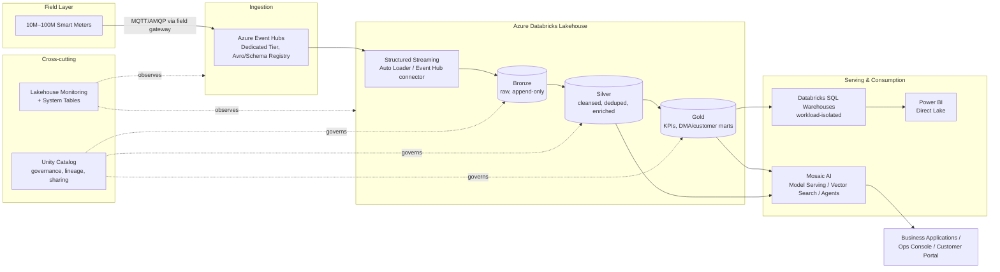

# Architecture Guide — Enterprise Smart Metering Data Platform

Status: **Phase 1 — architecture baseline.** Infrastructure has not been provisioned yet (Phase 2). This document is the source of truth that Terraform (Phase 2+) and pipeline code (Phase 3+) implement against.

## Table of Contents

1. [Business & Non-Functional Requirements](#business--non-functional-requirements)
2. [Capacity Planning](#capacity-planning)
3. [High-Level Architecture](#high-level-architecture)
4. [Low-Level Architecture](#low-level-architecture)
5. [Medallion Architecture Design](#medallion-architecture-design)
6. [Diagrams](#diagrams)
7. [Architectural Decisions & Trade-offs](#architectural-decisions--trade-offs)
8. [Disaster Recovery Summary](#disaster-recovery-summary)
9. [Cost Model Summary](#cost-model-summary)

---

## Business & Non-Functional Requirements

| Requirement | Target |
|---|---|
| Device count | 10M now → 100M designed-for |
| Telemetry interval | 15 minutes |
| Ingestion model | Continuous streaming, exactly-once to Bronze |
| Data loss | Zero — durable at every hop (Event Hub → checkpoints → Delta) |
| Analytics | Near-real-time (Silver latency < 5 min) + historical (Gold, batch/incremental) |
| AI | Leak detection, forecasting, anomaly detection, NL analytics, agentic assistant |
| Governance | Full lineage, RBAC/ABAC, row/column security, audit — Unity Catalog |
| Availability | 99.9% single-region; 99.95% with paired-region DR |
| Cost | Optimized for sustained streaming + bursty BI/AI workloads, not flat-rate overprovisioned |

## Capacity Planning

All downstream sizing (Event Hub partitions/throughput units, Spark executor counts, Delta partitioning/clustering, SQL Warehouse sizing) is derived from these baseline numbers.

### Event volume

```
10,000,000 meters × (24h × 60min / 15min) reads/day  = 960,000,000 reads/day   (10M meters)
100,000,000 meters × 96 reads/day                     = 9,600,000,000 reads/day (100M meters, design target)

Average ingress (10M):  960,000,000 / 86,400s  ≈ 11,111 events/sec
Average ingress (100M): 9,600,000,000 / 86,400s ≈ 111,111 events/sec
```

**Peak factor**: meters do not report perfectly uniformly — device clocks cluster around 15-minute boundaries (:00/:15/:30/:45), and network/backhaul retries add bursts after outages. We design for a **4x peak-to-average ratio**, i.e. sustained peaks of ~44,000 events/sec at 10M meters and ~444,000 events/sec at 100M meters, plus tolerance for multi-hour backlog catch-up after a field network outage (which can transiently exceed even that — handled by Event Hub's durable buffering + Structured Streaming's ability to drain backlog faster than real-time; see [ADR-0001](../decisions/ADR-0001-event-hub-vs-alternatives.md)).

### Record size and storage volume

A telemetry event (meter ID, timestamp, reading, flow rate, battery, signal quality, DMA ID, ~15 fields, Avro-encoded) is ~250–400 bytes on the wire. Assume 350 bytes average:

```
10M meters:  960M events/day × 350 bytes  ≈ 336 GB/day raw   ≈ 123 TB/year raw
100M meters: 9.6B events/day × 350 bytes  ≈ 3.36 TB/day raw  ≈ 1.23 PB/year raw
```

Bronze (Delta, uncompressed-ish with Parquet/Snappy) runs close to raw size; Silver (typed, deduplicated) is similar; Gold (aggregated) is one to two orders of magnitude smaller. With Delta's Parquet + Snappy compression (typically 3–5x for this kind of semi-structured numeric/telemetry data) and Z-order/Liquid Clustering co-locating similar values, expect **Bronze+Silver combined storage of roughly 30–50 TB/year at 10M meters**, scaling to **300–500 TB/year at 100M meters**, before lifecycle tiering. See [Cost Model Summary](#cost-model-summary) for the ADLS lifecycle policy that keeps this bounded.

### Compute sizing implications

- **Event Hubs**: at 11K–44K events/sec sustained/peak (10M meters), Standard tier (1K events/sec or 1MB/s per Throughput Unit, max 40 TUs, autoscale) is at its ceiling; we use **Dedicated tier (Capacity Units)** from day one so the 100M-meter target (111K–444K events/sec) is a partition/CU scaling exercise, not a tier migration. See [ADR-0001](../decisions/ADR-0001-event-hub-vs-alternatives.md).
- **Event Hub partitions**: sized for parallelism, not just throughput — partition count should be ≥ the max concurrent Spark streaming tasks we want reading in parallel. We start with **200 partitions** (10M meters), leaving room to grow to 800+ without a new Event Hub (partition count can only be increased, not decreased, and increasing it reshuffles key-to-partition mapping — so we intentionally start high rather than resizing later).
- **Bronze streaming cluster**: throughput-bound, not shuffle-bound (append-only writes, no joins) → favor many small/medium nodes with autoscaling over few large ones, Photon enabled for Parquet/Delta write acceleration.
- **Gold aggregation jobs**: shuffle-heavy (grouping by DMA, customer, hour/day) → benefit most from AQE (skew join handling, coalesce post-shuffle partitions) and Photon vectorized aggregation.
- **SQL Warehouses**: BI/executive dashboard queries hit Gold almost exclusively (small, pre-aggregated) → can run on small-to-medium Serverless SQL Warehouses with sub-second autoscaling; ad hoc analyst queries against Silver need a separate, larger, isolated warehouse (see [ADR-0005](../decisions/ADR-0005-sql-warehouse-isolation.md)).

---

## High-Level Architecture



**Why this shape**: a single durable ingestion broker (Event Hub) decouples 10–100M field devices from the Lakehouse's processing rate, so backpressure or maintenance in Databricks never causes device-side data loss — messages sit durably in Event Hub (configurable retention, up to 90 days on Dedicated) until consumed. The medallion layers (Bronze/Silver/Gold) exist so **exactly one raw, replayable copy of the truth** (Bronze) is separated from business logic (Silver/Gold), which can be redefined and reprocessed from Bronze without re-ingesting from the field. Unity Catalog and Lakehouse Monitoring are drawn as cross-cutting because they attach to every layer rather than sitting at one point in the pipeline.

## Low-Level Architecture

### 1. Field → Ingestion

Meters report over LPWAN/cellular to regional field gateways, which batch and forward over AMQP 1.0 to **Azure Event Hubs**. Each event carries: `meter_id`, `reading_timestamp` (device clock), `ingest_timestamp` (gateway clock), `reading_value`, `unit`, `flow_rate`, `battery_pct`, `signal_quality`, `dma_id`, `firmware_version`, `sequence_no`. Payloads are **Avro**, validated against a schema registered in **Azure Schema Registry** (Event Hubs-integrated), so malformed producers are rejected at the edge rather than polluting Bronze.

Partition key = `meter_id` (hashed) — guarantees per-meter ordering within a partition, which Silver's deduplication/late-arrival logic depends on (see below), while still spreading load evenly across 200+ partitions.

### 2. Ingestion → Bronze (Structured Streaming)

A Databricks **Structured Streaming** job (Lakeflow-managed in Phase 3) reads from Event Hubs using the Spark Event Hubs connector, with:

- **Trigger**: `availableNow`-style micro-batches is *not* used here (this is continuous, not scheduled); we use a fixed micro-batch interval tuned to the SLA (e.g. 30–60s) balancing latency against small-file overhead.
- **Checkpointing**: Delta-backed checkpoint location per stream in ADLS Gen2, giving exactly-once, resumable processing — a job restart resumes from the last committed offset, never re-reading already-committed Event Hub offsets nor skipping any.
- **Schema evolution**: Bronze table uses `mergeSchema` with a permissive mode — new optional fields from firmware upgrades land automatically; type changes or dropped required fields fail loudly (alert, not silent data loss).
- **Write target**: Delta table, **append-only**, partitioned by `ingest_date`, with the raw Avro/JSON payload preserved alongside parsed columns (so a parsing bug is recoverable by reprocessing Bronze, not by re-ingesting from the field, whose Event Hub retention window is finite).

### 3. Bronze → Silver

Silver is a Lakeflow Declarative Pipeline (Phase 4) applying, in order:

1. **Validation** (Lakeflow *Expectations*): range checks (reading ≥ 0, within plausible delta from previous reading), required-field checks, referential checks against a meter master (Unity Catalog dimension table). Failing rows are quarantined (`_silver_quarantine`) with a reason code, not dropped silently.
2. **Deduplication**: Delta's `MERGE` keyed on `(meter_id, reading_timestamp)`, since meters/gateways can redeliver on retry. Late-arriving retries of already-processed readings are idempotently discarded.
3. **Watermarking & late arrival**: a 24-hour watermark on `reading_timestamp` accommodates realistic field connectivity gaps (a meter with a dead cellular link catching up after reconnection) while bounding streaming state size. Readings arriving after the watermark still land in Silver via a nightly batch reconciliation pass (not dropped) but are excluded from the streaming aggregates that already closed.
4. **Standardization & enrichment**: unit normalization (all volumes to liters), timezone normalization to UTC with a stored local-offset for reporting, join against slowly-changing meter/customer/DMA dimension tables (Unity Catalog managed tables, SCD Type 2).

### 4. Silver → Gold

Gold is a set of business-purpose Delta tables, built as **incremental** Lakeflow pipelines (streaming where the KPI tolerates it, e.g. hourly consumption; batch/triggered where it doesn't, e.g. daily billing-adjacent aggregates that must wait for the day to fully close plus the late-arrival reconciliation window):

- `gold.hourly_consumption` — per-meter, per-hour volumetric usage
- `gold.daily_usage` — per-meter, per-day usage + anomaly flags
- `gold.dma_analytics` — District Meter Area balance (supply vs. metered consumption → non-revenue water / leak indicators)
- `gold.customer_analytics` — customer-level usage trends, billing-relevant aggregates
- `gold.operational_dashboard` / `gold.executive_dashboard` — pre-joined, pre-aggregated marts tuned for specific Power BI reports

### 5. Serving

Gold tables are queried via **role-specific SQL Warehouses** (BI, ad hoc, executive — see [ADR-0005](../decisions/ADR-0005-sql-warehouse-isolation.md)), consumed by Power BI (Direct Lake mode where the semantic model maps 1:1 to Gold, DirectQuery for ad hoc), and by Mosaic AI for feature retrieval (forecasting, anomaly models) and RAG grounding (NL analytics agent).

---

## Medallion Architecture Design

| Layer | Purpose | Table format guarantees | Retention |
|---|---|---|---|
| Bronze | Immutable raw ingestion, replay source | Append-only, schema-evolved, CDF enabled | 3 years hot, then archive tier |
| Silver | Validated, deduplicated, enriched single source of truth | MERGE-updated, CDF enabled, quarantine side-table | 3 years hot |
| Gold | Business-ready aggregates for BI/AI | Liquid Clustered, Predictive Optimization managed | Indefinite (small; aggregates) |

Why three layers and not two or four: two layers (raw + serving) forces cleansing logic to be re-derived by every consumer or baked irrecoverably into the serving layer; four+ layers (adding e.g. a separate "staging" layer) added operational overhead without a corresponding correctness or performance benefit for this workload — Bronze already serves as the replay point, and Silver already serves as the single validated source of truth. Medallion's three-layer split is also the shape Lakeflow Declarative Pipelines, Unity Catalog lineage, and Databricks' own operational tooling (DLT expectations, CDF) are built around, so following it minimizes custom tooling.

---

## Diagrams

Each is maintained as its own file so it can be versioned and reviewed independently:

- [Component Diagram](diagrams/component-diagram.md)
- [Deployment Diagram](diagrams/deployment-diagram.md)
- [Sequence Diagram](diagrams/sequence-diagram.md) — end-to-end meter reading → dashboard
- [Data Flow Diagram](diagrams/data-flow-diagram.md)
- [Network Diagram](diagrams/network-diagram.md)
- [Security Diagram](diagrams/security-diagram.md)
- [Disaster Recovery Architecture](diagrams/disaster-recovery-diagram.md)

## Architectural Decisions & Trade-offs

Full rationale lives in [docs/decisions/](../decisions/) as individually numbered ADRs. Summary:

| ADR | Decision | Rejected alternative(s) | Why |
|---|---|---|---|
| [0001](../decisions/ADR-0001-event-hub-vs-alternatives.md) | Azure Event Hubs (Dedicated) for ingestion | Azure IoT Hub, self-managed Kafka (HDInsight/AKS) | Native Databricks connector, higher raw throughput ceiling than IoT Hub, no cluster ops burden vs. self-managed Kafka |
| [0002](../decisions/ADR-0002-medallion-unity-catalog.md) | Medallion on Delta Lake + Unity Catalog | Lambda architecture (separate batch/speed layers), flat data warehouse | Single engine for streaming+batch, native governance/lineage, avoids dual-pipeline maintenance |
| [0003](../decisions/ADR-0003-lakeflow-declarative-pipelines.md) | Lakeflow Declarative Pipelines for Silver/Gold | Hand-rolled Structured Streaming jobs orchestrated by plain Databricks Jobs | Built-in expectations (data quality), lineage, and pipeline-level monitoring vs. custom equivalents |
| [0004](../decisions/ADR-0004-liquid-clustering.md) | Liquid Clustering (not static partitioning) on Silver/Gold | Hive-style date partitioning + manual `OPTIMIZE ZORDER` | Avoids partition-skew and small-file problems at 100M-meter scale; clustering keys can evolve without a full rewrite |
| [0005](../decisions/ADR-0005-sql-warehouse-isolation.md) | Workload-isolated SQL Warehouses (BI / ad hoc / executive) | One shared warehouse for all SQL consumption | Prevents a runaway analyst query from starving executive dashboard SLAs; independent autoscaling/cost attribution |
| [0006](../decisions/ADR-0006-unity-catalog-strategy.md) | Catalog-per-environment, schema-per-domain | Single catalog with environment-prefixed schemas | Hard isolation boundary for permissions/data sharing between dev/staging/prod; matches Databricks' recommended pattern |
| [0007](../decisions/ADR-0007-compute-strategy.md) | Serverless-first, Job Clusters for scheduled ETL, no All-Purpose in prod | All-Purpose clusters for everything | Serverless removes cluster-startup latency + idle cost for bursty/interactive workloads; Job Clusters are cheaper and isolated for scheduled production ETL |
| [0008](../decisions/ADR-0008-mosaic-ai-rag-strategy.md) | Mosaic AI Vector Search + Model Serving, in-workspace | External vector DB (e.g. Pinecone) + externally hosted models | Keeps embeddings/models inside the Unity Catalog governance boundary; avoids duplicating access control in a second system |
| [0009](../decisions/ADR-0009-event-hub-connector-protocol.md) | Kafka protocol for Spark consumption, native AMQP for producers | Native AMQP (`azure-eventhubs-spark`) for the consumer too | Kafka connector is Databricks' more mature, actively maintained integration path; AMQP keeps producer-side partition-key control |
| [0010](../decisions/ADR-0010-silver-dedup-and-late-arrival-strategy.md) | Watermarked streaming dedup (AUTO CDC) + nightly batch reconciliation for late arrivals | `dropDuplicatesWithinWatermark` with no reconciliation (drops late data); unbounded dedup state; pure-batch Silver | Bounds streaming state without violating zero-data-loss; keeps < 5 min Silver latency for the on-time majority |
| [0011](../decisions/ADR-0011-gold-pipeline-split-and-nrw-proxy.md) | Two Gold pipelines (continuous hourly, triggered daily marts); documented NRW proxy | One mixed-cadence pipeline; omitting NRW entirely; fabricating a synthetic bulk-supply feed | Correct cadence for each KPI's tolerance; NRW proxy demonstrates the calculation shape without manufacturing false confidence |

## Disaster Recovery Summary

Full diagram and runbook: [diagrams/disaster-recovery-diagram.md](diagrams/disaster-recovery-diagram.md), [runbooks/](../runbooks/).

- **Storage**: ADLS Gen2 with GZRS (geo-zone-redundant) in production — zone-redundant within the primary region, geo-replicated asynchronously to a paired region.
- **Compute**: Databricks workspace deployed in a secondary region via Terraform (same module, different `region` variable), kept warm-standby (no running clusters, but Unity Catalog metastore and networking pre-provisioned) to minimize RTO.
- **Streaming state**: checkpoints live in ADLS (replicated); Event Hubs Geo-Disaster Recovery (metadata-only pairing, alias-based failover) points consumers at the secondary namespace without a connection-string change.
- **RPO**: effectively zero for data at rest (Delta + GZRS); bounded by Event Hub geo-DR replication lag (~seconds) for in-flight events during a regional failure.
- **RTO target**: < 1 hour for the streaming path (Event Hub geo-DR failover + restart of standby Structured Streaming jobs from last committed checkpoint), < 4 hours for full BI/AI serving restoration.

## Cost Model Summary

Full detail: [ADR-0007](../decisions/ADR-0007-compute-strategy.md) and the (Phase 8) Performance & Cost Guide. Headline levers:

- **Serverless SQL Warehouses** for BI (auto-stop in seconds, no idle spend) vs. always-on classic compute.
- **Job Clusters, not All-Purpose**, for every scheduled Bronze/Silver/Gold pipeline — isolated cost attribution per pipeline, autoscale-to-zero between runs.
- **Predictive Optimization** (Unity Catalog-managed OPTIMIZE/VACUUM) instead of fixed-schedule maintenance jobs — avoids both under-optimized (query-cost) and over-optimized (compute-cost) tables.
- **ADLS lifecycle policy**: Bronze raw data moves Hot → Cool at 90 days, Cool → Archive at 1 year, aligned with the 3-year hot-retention requirement above and typical utility regulatory retention (7 years) satisfied cheaply in Archive tier.
- **Photon everywhere** it's supported — reduces cluster-seconds needed for the same job, which dominates cost more than the per-DBU Photon premium at this data volume.
