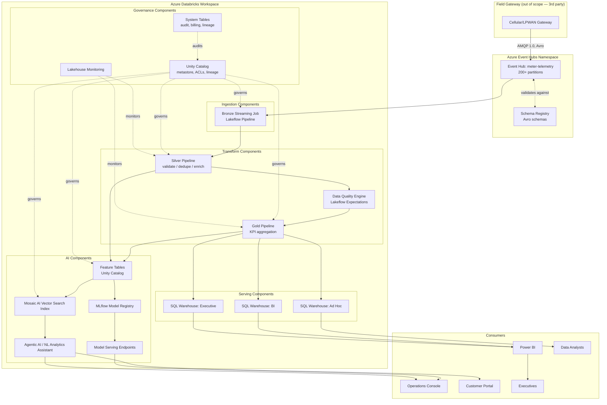

# Component Diagram

Shows the logical software components and their direct dependencies, independent of physical deployment (see [Deployment Diagram](deployment-diagram.md) for that view).

## Component Responsibilities

| Component | Responsibility | Owning phase |
|---|---|---|
| Event Hub namespace + Schema Registry | Durable, ordered, schema-validated ingestion buffer | Phase 3 |
| Bronze Streaming Job | Exactly-once landing of raw telemetry into Delta | Phase 3 |
| Silver Pipeline + Data Quality Engine | Cleansing, dedup, enrichment, quarantine of bad records | Phase 4 |
| Gold Pipeline | Business KPI and mart computation | Phase 5 |
| SQL Warehouses (BI/Ad Hoc/Executive) | Isolated, right-sized query compute per consumer class | Phase 6 |
| Feature Tables, MLflow Registry, Model Serving, Vector Search, Agent | ML/AI use cases (leak detection, forecasting, RAG, NL assistant) | Phase 7 |
| Unity Catalog, Lakehouse Monitoring, System Tables | Cross-cutting governance, quality monitoring, audit | Phases 2 & 8 |
