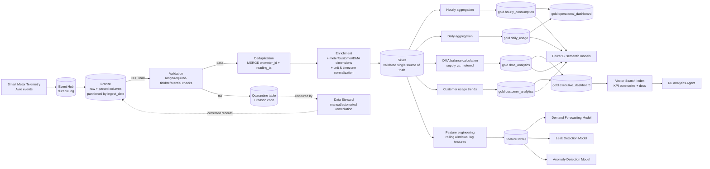

# Data Flow Diagram

Focuses on data transformations and state, not infrastructure.

## Data Contracts Between Stages

| Boundary | Contract |
|---|---|
| Event Hub → Bronze | Avro schema (Schema Registry-enforced); unknown fields preserved in raw payload column |
| Bronze → Silver | At-least-once from Bronze (dedup happens in Silver); CDF used so Silver only processes changed rows |
| Silver → Gold | Silver is the only table Gold reads business logic from — Gold never reads Bronze directly |
| Silver/Gold → AI | Feature tables are the only sanctioned read path for ML — models never read Bronze/raw directly |
| Gold → BI | Gold tables are pre-joined/pre-aggregated to match each Power BI semantic model 1:1, avoiding BI-side fan-out joins |
