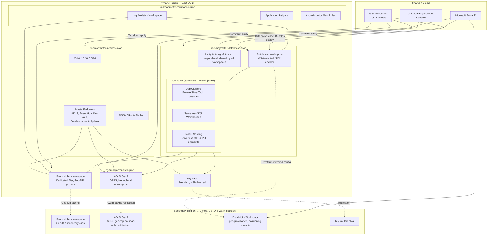

# Deployment Diagram

Physical/Azure resource placement across regions and environments. Primary region: **East US 2**. DR/secondary region: **Central US** (Azure paired region, satisfies data-residency and paired-region SLA guidance).

## Environment Topology

| Environment | Resource groups | Databricks workspace | Unity Catalog metastore | Notes |
|---|---|---|---|---|
| dev | `rg-smartmeter-*-dev` | `dbx-smartmeter-dev` | Shared dev/staging metastore (region-level) | Smaller SKUs, shorter Event Hub retention |
| staging | `rg-smartmeter-*-staging` | `dbx-smartmeter-staging` | Shared dev/staging metastore | Production-shaped, production-scale-down data |
| prod | `rg-smartmeter-*-prod` (+ secondary region) | `dbx-smartmeter-prod` | Dedicated prod metastore | Full HA/DR, Dedicated Event Hub tier |

One Unity Catalog **metastore per region**, attached to all workspaces in that environment tier — not one per workspace — per Databricks' recommended account topology (see [ADR-0006](../decisions/ADR-0006-unity-catalog-strategy.md)).
