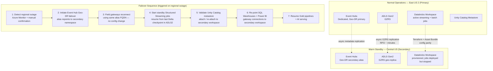

# Disaster Recovery Architecture

Strategy: **warm standby** in a paired Azure region. Not active-active (cost of running duplicate streaming compute continuously is not justified against the RTO target), not cold/backup-restore-only (RTO would exceed the < 1 hour streaming-path target).

## Recovery Objectives

| Component | RPO | RTO | Mechanism |
|---|---|---|---|
| Event Hub (in-flight events) | Seconds (Geo-DR replication lag) | < 15 min | Geo-Disaster Recovery alias failover (metadata + config, not data — Dedicated tier retains enough buffer that a fast failover avoids data loss for events not yet consumed) |
| ADLS Gen2 (Bronze/Silver/Gold + checkpoints) | Near-zero (GZRS is zone-redundant sync in-region; cross-region async, minutes) | < 30 min to confirm replica consistency | GZRS geo-replication; Delta's transaction log ensures the replica is always at a consistent commit boundary, never mid-write |
| Streaming pipelines | Zero (resumes from last committed checkpoint) | < 1 hour | Checkpoints stored in replicated ADLS; standby jobs pre-deployed via Asset Bundles, started on failover |
| Unity Catalog metadata | Near-zero | < 30 min | Metastore is regional; DR runbook re-attaches secondary workspace to a metastore replica / re-registers catalogs (see [runbooks/dr-failover.md](../runbooks/dr-failover.md) — added in Phase 8) |
| BI / AI serving | N/A | < 4 hours | Full restoration is lowest priority — dependent on pipelines being healthy first |

## Backup Strategy (independent of regional DR)

- **Delta Time Travel** (default 30-day log retention, extended to 90 days for Gold via table property) covers accidental-write/logic-bug recovery without invoking full DR.
- **Deep clones** of Gold tables taken weekly to a separate, access-restricted schema — protects against a catastrophic `VACUUM`-related loss of time-travel history or a Unity Catalog permissions misconfiguration that a metastore-level restore wouldn't fix quickly.
- **Terraform state** stored in a separate, versioned, geo-redundant storage account (not the same account as data) with soft-delete + versioning enabled — infrastructure itself is reproducible from code, but state must survive independently of the environment it describes.
