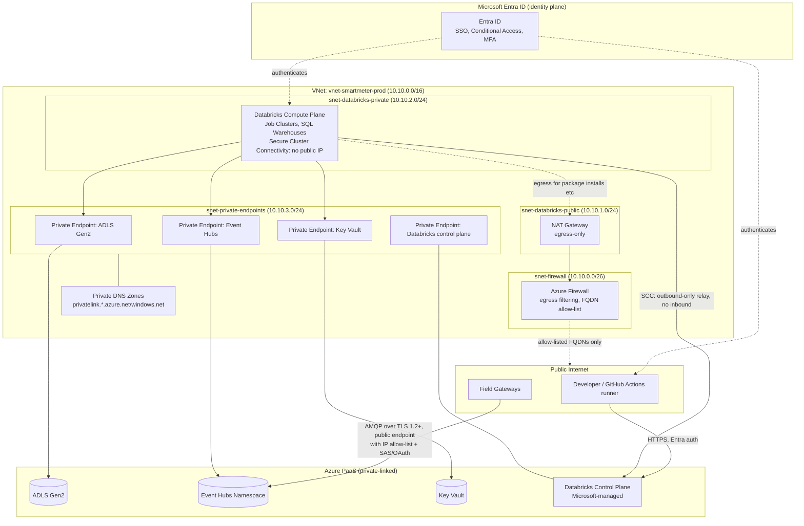

# Network Diagram

All PaaS control-plane traffic and data-plane traffic between Databricks compute and dependent services (ADLS, Event Hubs, Key Vault) is designed to stay off the public internet.

## Key Network Controls

| Control | Implementation |
|---|---|
| No public IPs on compute | Databricks **Secure Cluster Connectivity (SCC)** — all control-plane communication is outbound-only from the customer VNet |
| No public data-plane access | **Private Endpoints** for ADLS Gen2, Event Hubs, Key Vault, and the Databricks workspace's own front-end; public network access disabled on each resource |
| Egress control | **Azure Firewall** with FQDN allow-listing for package repos (PyPI, Maven Central mirrors) and Databricks/MLflow artifact endpoints; all other egress denied |
| Field ingestion path | Event Hubs public endpoint restricted via **IP firewall rules** to known gateway egress ranges, plus SAS-token/OAuth authentication — evaluated in Phase 8 for migration to a dedicated ingestion path (e.g. ExpressRoute) if gateway IP ranges stabilize |
| Name resolution | **Private DNS Zones** linked to the VNet so private-endpoint FQDNs resolve to private IPs, including from peered dev/staging VNets |
| Environment isolation | Separate VNets per environment (dev/staging/prod), peered only where explicitly required (none, by default) |
