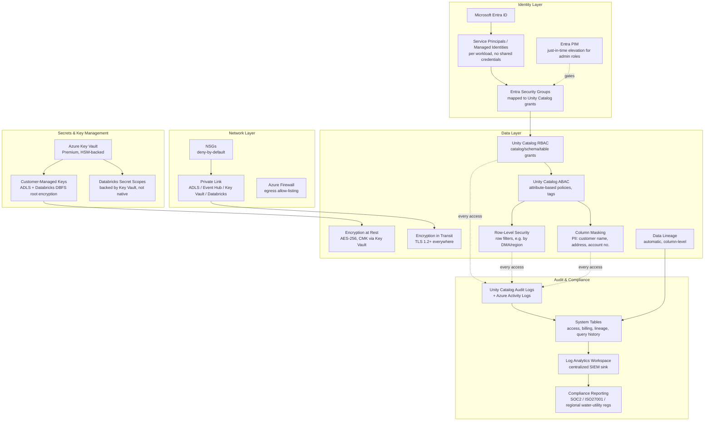

# Security Diagram

Layered security model: identity → network → data → application, mapped to Zero Trust principles (verify explicitly, least privilege, assume breach).

## Security Control Matrix

| Threat | Control |
|---|---|
| Credential theft / shared secrets | Managed Identities + Service Principals per workload; no embedded connection strings; Key Vault-backed Databricks secret scopes |
| Lateral movement via network | Private Link everywhere, deny-by-default NSGs, Azure Firewall egress allow-listing |
| Data exfiltration | Private endpoints (no public data-plane path), Unity Catalog governs even ad hoc SQL access, egress FQDN allow-listing prevents arbitrary outbound |
| Unauthorized PII access | Column masking (customer PII) + row-level security (DMA/region scoping) enforced at the Unity Catalog layer, not per-application |
| Privilege creep | Entra PIM just-in-time elevation for workspace/catalog admin roles; standing access is read-scoped by default |
| Undetected access / tampering | Unity Catalog audit logs + system tables, centralized in Log Analytics with alerting on anomalous access patterns |
| Data at rest exposure | AES-256 encryption, customer-managed keys via Key Vault (meets utility-sector data sovereignty requirements) |
| Data in transit exposure | TLS 1.2+ enforced on every hop, including field gateway → Event Hub |

See [ADR set](../decisions/) for the reasoning behind each governance choice, and the (Phase 8) Security Guide for operational procedures (key rotation, access reviews, incident response).
