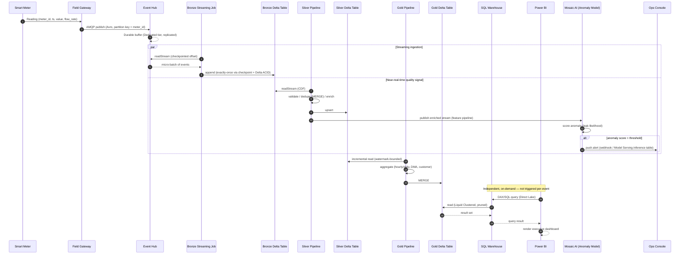

# Sequence Diagram — End-to-End Meter Reading

Traces a single meter reading from the device to an executive's Power BI dashboard, and separately, the path into an AI-driven leak alert.

## Timing Expectations

| Hop | Target latency | Notes |
|---|---|---|
| Meter → Event Hub | Seconds (network-dependent) | Outside platform control |
| Event Hub → Bronze | < 60s | Micro-batch interval |
| Bronze → Silver | < 5 min | Includes validation + dedup MERGE |
| Silver → anomaly alert | < 10 min | Feature computation + model inference |
| Silver → Gold | 15 min – hourly (KPI-dependent) | Hourly KPIs vs. daily KPIs run on different schedules |
| Gold → dashboard | Sub-second | Direct Lake / pre-aggregated Gold |
